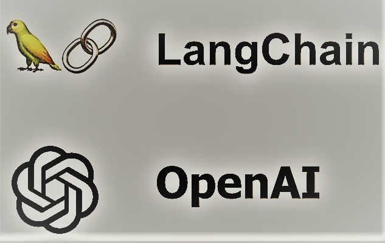
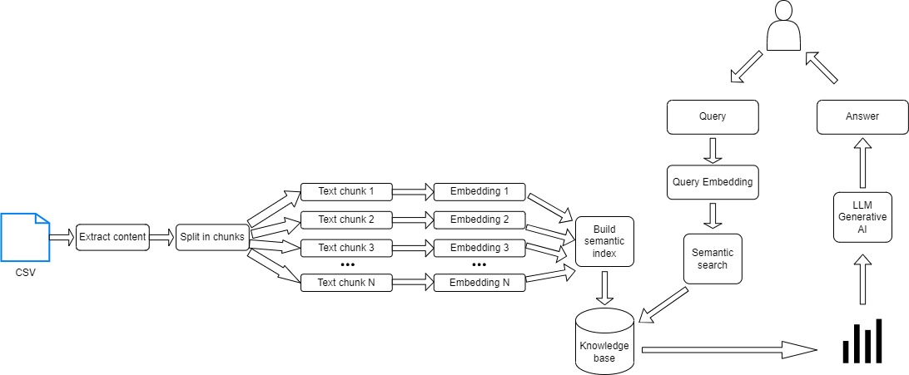

# AI-Powered Job Tool
#### An AI-Powered Support Job Tool Chatbot with LangChain

### Introduction

JT-Chat is an AI chatbot that assists users in preparing for a Data Science role. It is built on Langchain and under the hood, JT-Chat uses OpenAI's text-davinci-003 Model as its large language model (LLM) for text generation. JT-Chat was also built using the Streamlit library which was employed to provide a user-friendly interface.

### Features
JT-Chat comes packed with the following features:

1. Data Science Interview Preparation:

2. Data Science Resume Assistance:

3. Data Science Cover Letter: 

### System Design

- Langchain: Langchain is a Python framework specifically designed for language-related tasks. It acts as the primary translation engine for Wazobia, enabling seamless language conversion between different Nigerian languages.

- Streamlit: Streamlit provides the web application framework for Wazobia. With Streamlit, Wazobia delivers a user-friendly interface that facilitates easy interaction with the translation and PDF analysis functionalities.

- OpenAI's text-davinci-003 Model: Wazobia leverages the power of OpenAI's text-davinci-003 model as its backend language processing engine. This AI model plays a crucial role in providing accurate translations and extracting relevant information from PDF documents.